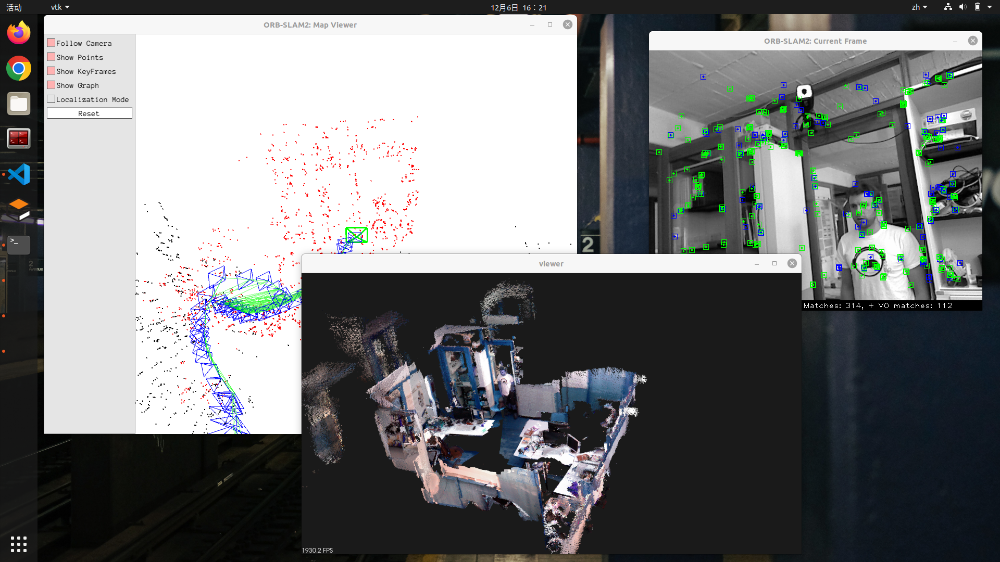

针对ubuntu18.04系统做了验证，窗口环境为x11

#### 基础环境配置：

1、更新系统及安装必要工具

```bash
sudo apt update && sudo apt upgrade
sudo apt install cmake make gcc g++ git python2
```

2、安装编译依赖

```bash
sudo apt install -y libboost-all-dev libglew-dev libgtk2.0-dev \
libavcodec-dev libavformat-dev libswscale-dev libjpeg-dev libpng-dev \
libtiff-dev libopenexr-dev libxi-dev libxrandr-dev libx11-dev \
libglu1-mesa-dev libgl1-mesa-dev libusb-1.0-0-dev libudev-dev doxygen \
doxygen-doc libxkbcommon-dev
```

3、安装eigen3（3.3.）

```bash
sudo apt install libeigen3-dev
```

4、安装opencv

```bash
sudo apt install libopencv-dev libopencv-highgui-dev libopencv-contrib-dev
```

5、安装Pangolin-0.5

```bash
git clone https://github.com/stevenlovegrove/Pangolin -b v0.5
cd Pangolin
mkdir build
cd build
cmake ..
make -j
sudo make install
```

#### ORB_SLAM2配置流程：

1、编译安装修改过的g2o

```bash
cd g2o_with_orbslam2
mkdir build && cd build
cmake ..
make -j
sudo make install
```

2、编译ORB_SLAM2

```bash
cd ORB_SLAM2_modified
./build.sh
#For ROS(可选)
#1
sudo vim ~/.bashrc
export ROS_PACKAGE_PATH=${ROS_PACKAGE_PATH}:/home/ubuntu/ORBSLAM2_with_pointcloud_map/ORB_SLAM2_modified/Examples/ROS
source ~/.bashrc
#2
cd ORB_SLAM2_modified
./build_ros.sh
```

#### 文件解释：

```bash
ORB_SLAM2_modified\Examples\RGB-D\associations	#各类数据集在无ROS环境下运行所需的association.txt
ORB_SLAM2_modified\tools\bin_vocabulary.cc		#ORBvoc.txt转ORBvoc.bin
tum1.sh			#TUM1数据集（无ROS）
ros_tum1.sh		#TUM1数据集（无ROS）
```

